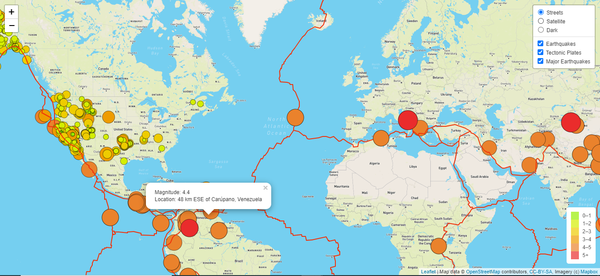
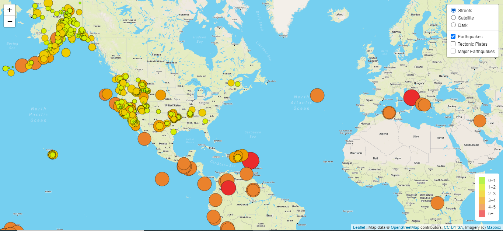
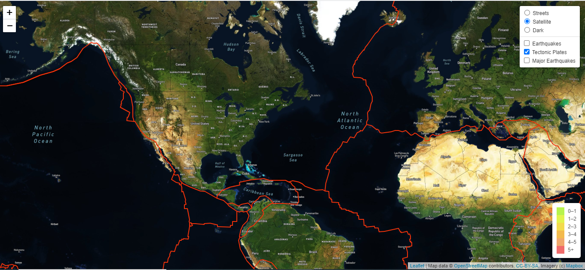
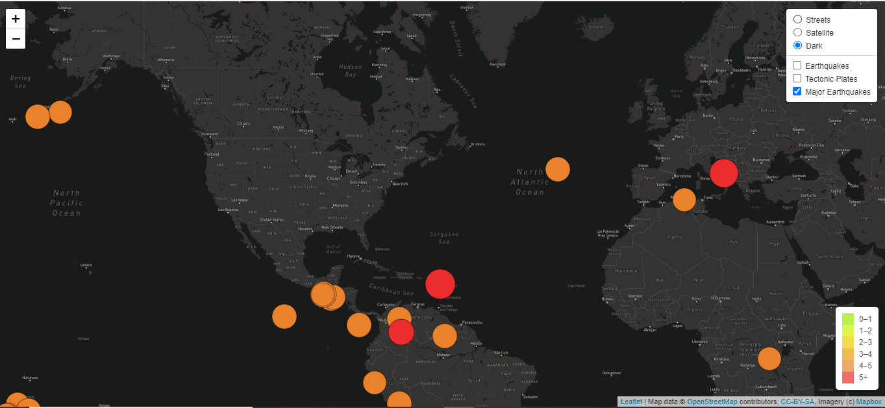

# Mapping Earthquakes

## Overview

I have just landed a job of Data Visualization Specialist in Disaster Reporting Network, a non-profit company that provides data driven storytelling for disasters around the world. My job is to build insightful data visualizations with interactive features on earthquakes around the world. 

## Pupose
The head of the earthquake response team believes that this project will be helpful for his team which includes reporters and data visualization specialists. He think making earthquake maps informative and easy-to-use on mobile phones and desktops will be good for Disaster Reporting Network's popularity. 

I will be working on website and mobile application development for this project by using latest GeoJSON data from US Geological Survey website and other sources. 

**Tools to Traverse & Retrieve Data**: JavaScript, D3, and Leaflet libraries

**Tools to Plot the Data**: Mapbox maps (through API)

**Data Sources**: [US Geological Surve](https://www.usgs.gov/),  [Tectonic Plates Github Repository](https://github.com/fraxen/tectonicplates)

## Earthquake Data Map

On the earthquake map, there are three different types of data (or layers) have been visualized. Users can toggle these layers on and off from top right hand side.

1.  **All Earthquake Data:**  The locations of the earthquakes are shown with circular markers using GeoJSON layer. The magnitude of the earthquake is reflected by diameter and color of the marker. If we click on any of these markers, a pop-up will appear showing the magnitude and name of the location for the earthquake. A lgend is provided for color and magnitude information.

2. **Tectonic Plates Data:**  Tectonic plates data is visualized as map lines on the map using GeoJSON layer. The tectonic plates are styled with distinct color and weight so that it is easily visible.

3. **Major Earthquakes Data:** This layer shows cicular markers for earthquakes with magnitude greater than 4.5. The color and radius is similar to the all earthquake data so that it matches the legend. 

Also, there are three map styles to choose from:

1. Streets
2. Satellite
3. Dark

**Map With All The Earthquake Data Options and Popup**

**Streets Map With Earthquake Markers**

 

**Satellite Map With Tectonic Plates**

 

**Dark Map With Major Earthquake Markers**

